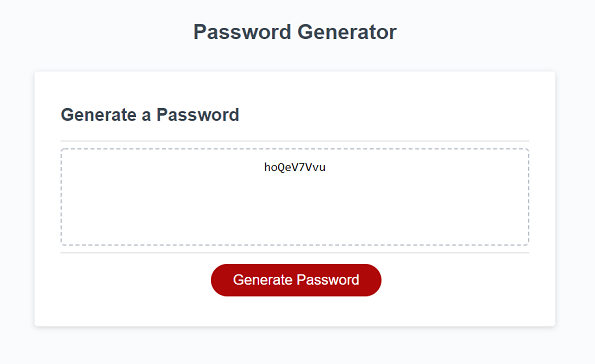

# Password Generator

The password generator will create a random password with the following criteria

1. Password is atleast 8 up to a maximum of 128 characters in length.
2. At least one of following character sets is choosen.
    <ul>   
        <li>Lower case</li>
        <li>Upper case</li>
        <li>Numbers</li>
        <li>Special characters</li>
         
    </ul>
 
Once these two conditions are met the random password will output to the text window as shown in the example below.
   

<em>In this example the user requested a 9 character password </em>

## Live URL

[Password Generator Site](https://rsternik.github.io/Homework_Password_Generator/)

